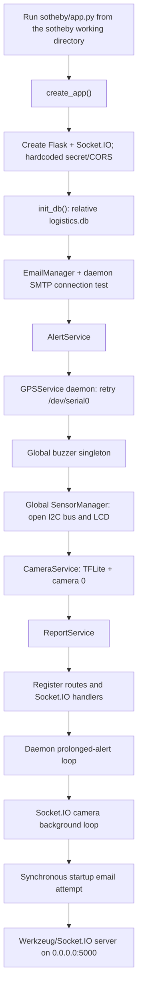
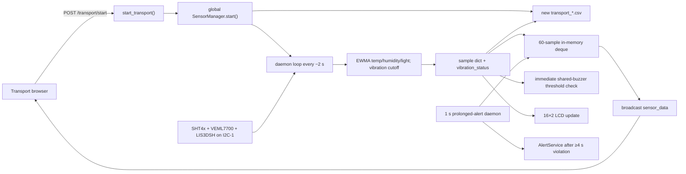
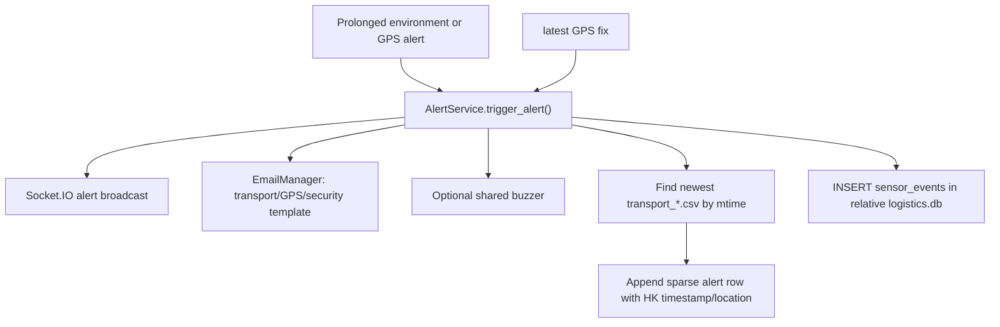
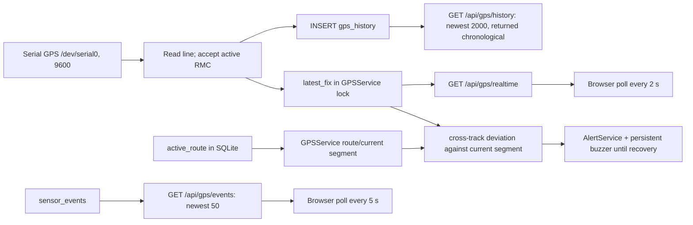
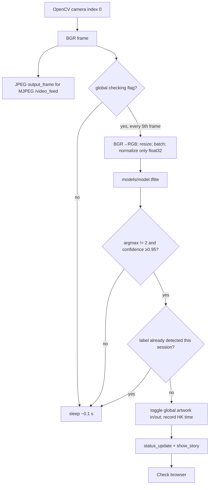
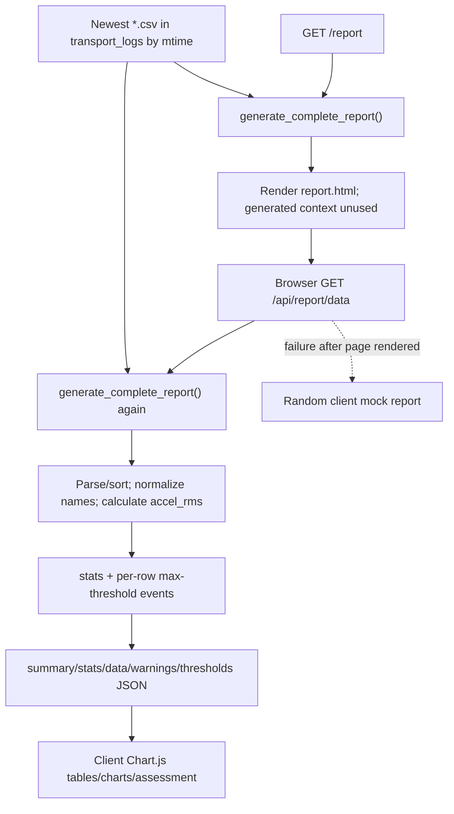

# Legacy Data Flow

## Startup and process lifecycle

Source: `sotheby/app.py:create_app` and main block. Sensor sampling does **not** start at application startup; it starts on `POST /transport/start`. GPS and camera loops start at application startup regardless of transport state.

Ctrl+C cleans the buzzer and camera and attempts email, but leaves sensor/GPS/I2C/CSV cleanup implicit. `manage.sh stop` sends a process signal and broad `pkill` patterns, so it does not guarantee the Python shutdown branch (`sotheby/app.py`; `sotheby/manage.sh`).

## Transport sensor path

Detailed order is read → filter/derive → immediate buzzer check → append memory → write/flush CSV → display → Socket.IO (`sotheby/sensor.py:SensorManager._run_loop`). A per-cycle exception is printed and the next cycle continues.

`POST /transport/stop` sets `_running=False`, clears the deque, closes CSV, stops the shared buzzer, updates the LCD, performs the GPS waypoint-distance check, stops the buzzer again through `AlertService`, broadcasts `transport_status`, and leaves GPS/camera/artwork state running (`sotheby/sensor.py:stop_transport`).

## Alert fan-out and persistence

Source: `sotheby/services/alert_service.py:trigger_alert`; `sotheby/data_access/data.py:append_alert_location`; `sotheby/data_access/database.py:log_sensor_event`.

Important boundaries:

- Immediate environmental buzzer checks bypass `AlertService`, so they are not web/email/CSV/SQLite events.
- Prolonged temperature/humidity/light alerts use `AlertService` but do not activate the buzzer; the separate immediate path is expected to be sounding already.
- Vibration has no prolonged/email path.
- Alert CSV writes are not tied to the active `CSVLogger` instance and may target a prior session when transport is inactive.
- GPS “still deviated” fixes create repeated web/CSV/SQLite events, with only email suppressed.
- GPS and environmental paths share one buzzer and can stop each other.

## GPS and route flow

Route UI clicks form a waypoint array. `POST /api/route/set` replaces the single active-route row and synchronously calls `GPSService.load_route_from_db()`. `POST /api/data/clear` deletes GPS history, events, and route; `/api/route/clear` instead writes an empty route row (`sotheby/templates/gps.html`; `sotheby/services/gps/gps_tracking.py`; `sotheby/data_access/database.py`).

The GPS browser loads history and route only at map initialization, not on the periodic timers. OpenStreetMap tiles remain an external runtime dependency (`sotheby/templates/gps.html:initMap`).

## Artwork identification and custody state

Source: `sotheby/services/camera_service.py:camera_loop`, `run_inference`, `apply_detection`; `sotheby/blueprints/check_bp.py`; `sotheby/templates/check.html`.

Socket.IO command/event sequence:

1. Any default-namespace connection invokes the check handler and sends current `status_update` and `phase_update` to that client.
2. Browser emits `start_check`; global checking becomes true, the session-detection set is cleared, and `phase_update(true)` plus `clear_story` are broadcast.
3. First accepted label detection toggles its global state, broadcasts the full artwork table and static story.
4. Browser emits `done_check`; only `phase_update(false)` is broadcast. No database/CSV custody record or transport association is created.

## Report flow

Source: `sotheby/blueprints/report_bp.py`; `sotheby/services/report_service.py`; `sotheby/templates/report.html:loadReport`.

Server-side Matplotlib plots and `major_events` are computed but omitted from the JSON payload and unused by the current template. `GET /report/download/csv` sends only the newest CSV with a misleading “combined” download name.

## Storage schemas and timing

| Store | Producer | Consumer | Timing/retention |
|---|---|---|---|
| Sensor deque | `SensorManager._run_loop` | Socket.IO, `/transport/data`, prolonged-alert loop | 60 samples; cleared on stop |
| Per-session CSV | `CSVLogger` plus sparse `append_alert_location` | `ReportService`, download route | New on start; flushed each row; newest file chosen by mtime |
| `gps_history` | Every valid RMC | GPS history API/map | Unbounded until reset; API returns latest 2000 chronologically |
| `sensor_events` | `AlertService.trigger_alert` | GPS event API/map | Unbounded until reset; API returns latest 50 newest-first |
| `active_route` | Route APIs | GPS thread/start-stop distance checks | Intended one row at ID 1; empty row may represent cleared route |
| Artwork state | `CameraService.apply_detection` | Socket.IO check UI | Memory only; process lifetime |
| Logs | configured module loggers and management redirection | Operator/stale evidence | Rotating module logs are 10 MB×5 backups; management uses separate `app.log` |

CSV/Hong Kong time, SQLite `CURRENT_TIMESTAMP`, NMEA time, and local `time.strftime`/`datetime.fromtimestamp` are not normalized to one explicit time basis (`sotheby/utils/time_utils.py`; `sotheby/data_access/database.py`; `sotheby/email_manager.py`; `sotheby/services/alert_service.py`).

## External/unavailable-service branches

| Dependency unavailable | Resulting flow |
|---|---|
| Required Python import | `app.py` logs critical and exits |
| I2C bus | Transport can start and log/emit `None` sensor fields; display absent |
| Individual sensor after read error | Device flag becomes false; no recovery path |
| GPIO | Console-simulation buzzer, still reported enabled |
| GPS serial | GPS daemon retries forever; Flask/camera/sensors continue |
| GPS fix | route-distance checks return silently; UI remains No Fix/Scanning |
| Camera | background reconnect forever; MJPEG placeholder/empty bytes |
| TFLite/model | streaming continues; inference always “None” |
| SMTP | app usually continues; callers may falsely log success; synchronous send may block |
| Socket.IO client library/connection | transport shows errors; HTTP start/stop still callable; no polling fallback for sensor samples in the page |
| Chart.js | transport chart creation returns null and values can still update; report rendering throws and shows an error |
| Leaflet | intended error branch calls undefined `showError`, causing another browser error |
| OpenStreetMap/Google Fonts | map tiles/fonts unavailable; local application logic continues |
| CSV missing/invalid | report endpoint returns 404/500; direct report page generally cannot reach its mock fallback |

## Cross-module coupling that reconstruction must preserve or explicitly resolve later

- `ReportService` imports scalar thresholds from top-level `sensor`; its import therefore also requires I2C-related `smbus2` even for offline report generation (`sotheby/services/report_service.py` module initialization).
- `SensorManager` directly invokes hardware buzzer/display, CSV, and Socket.IO in one sampling loop (`sotheby/sensor.py`).
- `AlertService` dynamically imports the global buzzer and opportunistically reads a `gps_service` attribute assigned after construction (`sotheby/app.py`; `sotheby/services/alert_service.py`).
- GPS thread reaches into `app.alert_service`; route HTTP handlers mutate GPS thread state synchronously (`sotheby/services/gps/gps_service.py`; `gps_tracking.py`).
- Routes depend on custom attributes attached to Flask `current_app`, not constructor-injected route services.
- Relative imports/paths assume execution from the `sotheby` directory; report, model, logs, and SQLite may resolve elsewhere under another working directory.
